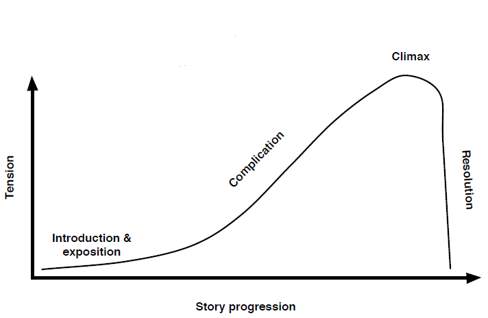

# Building Software Architectures

SDD Deep Dive, 11-13 November 2019, [Neal Ford](nealford.com), [@neal4d](https://www.twitter.com/neal4d)
 
This workshop is also presented by [Mark Richards](http://www.wmrichards.com)

These notes are a merging of the slides provided by Neal, alongside my own notes and my own further references.  

**_Unless credited otherwise, images are from Neal's slide deck from the workshop._**

## What is Software Architecture?

> "the highest level concept of a system in its environment. The architecture of a software system (at a given point in time) is its organization or structure of significant components interacting through interfaces, those components being composed of successively smaller components and interfaces."

Rational Unified Process definition, working off the IEEE definition.

[http://martinfowler.com/ieeeSoftware/whoNeedsArchitect.pdf](http://martinfowler.com/ieeeSoftware/whoNeedsArchitect.pdf)

**Resources**

(O'Reily video - SOftware Architecture Fundamentals)[https://learning.oreilly.com/videos/software-architecture-fundamentals/9781491998991?autoplay=false]

### Architecture is the highest level concept of the expert developers.

> "In most successful software projects, the expert developers working on that project have a shared understanding of the system design. This shared understanding is called ‘architecture.’ This understanding includes how the system is divided into components and how the components interact through interfaces. These components are usually composed of smaller components, but the architecture only includes the components and interfaces that are understood by all the
developers."

[http://martinfowler.com/ieeeSoftware/whoNeedsArchitect.pdf](http://martinfowler.com/ieeeSoftware/whoNeedsArchitect.pdf)

> Architecture is about the important stuff.
 
> Whatever that is.

Ralph Johnson

[http://martinfowler.com/ieeeSoftware/whoNeedsArchitect.pdf](http://martinfowler.com/ieeeSoftware/whoNeedsArchitect.pdf)

* Stuff includes parts from multiple parts of the system
  * developers
  * product owners
  * operations
* architecture enocmpasses
  * architecture decisions
  * design principles
* Architects must understand the benefits of everything and also the tradeoffs of everything.  It is their remit to present least-worst options.
* In the case of an architect feeling [imposter syndrome](https://en.wikipedia.org/wiki/Impostor_syndrome), they should defer to others to get the information and knowledge they need.
* Decisions can (and should) depend on domain knowledge.
* It is important for an architect to spread into 'other worlds' - eg, have an understanding of Java, Python, Rails, ...
* Software architecture reflects the mapping between capabilities and constraints.

### Some Architecture Titles

| | |
|---|---|
| Application Architect | Solutions Architect |
| Enterprise Architect | Systems Architect |
| Integration Architect | Data Architect |
| Security Architect | Network Architect |
| Information Architect | Business Architect |
| Technical Architect |

## Expectations of an Architect

* define the architecture and design principles to guide technology decisions for the enterprise
* analyze the *current* technology environment and recommend solutions for improvement
* analyze technology and industry trends and keep current with the latest trends
* ensure compliance with the architecture
  * don't be a 'parachute architect'
* have exposure to multiple and diverse technologies, platforms, and environments
* have a certain level of business domain expertise
* possess exceptional interpersonal skills, including teamwork, facilitation, and negotiation
* understand the political climate of the enterprise and be able to navigate the politics

## Architectural Thinking

* Technical breadth vs technical depth
  * stuff you know 
    * stuff you have to maintain
  * stuff you know you don't know
  * stuff you don't know you don't know

[Knowledge Breadth vs Depth](http://nealford.com/memeagora/2015/09/08/knowledge-breadth-versus-depth.html)

* Architecture is not design - where do you draw the line?
  * architect vs designer should be a 2-way colaboration - this is where difficulties lie
  * try to break down the wall
  * have developer / architect on same team

## Architecture Characteristics

Architecture charactistics are dependent on current and future business (and system) requirements.  They are known as `non-functional requirements` (but it's better to call them `system qualities`).  These do not cover quality assurances.

* do you know you concurrent user load right now?
* do you know the requirements for scalability?
* do you know the requirements for availability?
* these requirements come from the business

### Architecture characteristics could:

* specify a non-domain design consideration
  * explicit characteristics
* influence some structural aspect of the design
  * implicit characteristics
* are critical or important to application success
  * architecture characteristics

------ review slides p62 - and how all this fits...

Identifying the 'correct' characteristics will aide in the choice of [architecture patterns](#architecture-patterns) (aka styles).  Least-worst choices will lead to good testability; deployability; compliance; recovery, and improve time-to-market.  It is important to consider what the future might be, and how any architecture will fit into it.

It is good to define a `ubiquitous language`, so that when talking about performance (for example), everyone knows what it means.

### Main Architecture Characteristics

* reliability
* scalability
  * ability to handle gradual increase in users over time
* performance
  * measure and track average response times (cumulative)
  * measure and track maximum response times
  * a guide to performance can be obtained from [Lighthouse](https://developers.google.com/web/tools/lighthouse/), available within Chrome Tools
  * (mobile devices currently (2019) have the 'fastest' web browsers)
* availability
* elasticity
  * spikes in user activity over time(s)
* Other 'ilities' can be referenced from a [long list of quality attributes](https://en.wikipedia.org/wiki/List_of_system_quality_attributes)

There are _three_ sources of architecture characteristics:

* explicit requirements
* environmental knowledge
  * market place demands
* inherent domain knowledge

### Examples

Some possible business requirements and possible primary characteristics to consider (transpiling requirements):

* "our business is constantly changing to meet new demands of the marketplace"
  1. extensibility
  2. maintainability
  3. agility
  4. modularity
* "due to new regulatory requirements, it is imperative that we complete end-of-day processing in time
  1. performance
  2. scalability
  3. availability
  4. reliability
* "we need faster time to market to
remain competitive"
  1. maintainability
  2. agility
  3. modularity
  4. deployability
  5. testability
* "our plan is to engage heavily in
mergers and acquisitions in the next
three years"
  1. scalability
  2. extensibility
  3. openness
  4. standards-based

## Component-based Thinking

### component identification and granularity

TODO!!

## Software Architecture Patterns (Styles)

**Resources**

Book, PDF: [Software Architecture Patterns, Mark Richards, 2015](https://www.oreilly.com/programming/free/files/software-architecture-patterns.pdf)

> Architecture patterns help define the basic characteristics and behavior of the application

There are two types of pattern classification:

* monolithic
  * layered
  * microkernel (plug-in)
  * pipeline (pipe and filter)
* distributed
  * event-driven
  * space-based
  * microservices
  * service-oriented
  * service-based

It is also possible (and almost inevitable) to have hybrid patterns, for example:

* event-driven layered
* event-driven microservices
* layered microkernel
* space-based microservices

### Architectural Overview based on Primary Characteristics

| | agility | deployment | testability | performance | scalability | simplicity | cost |
|--|:--:|:--:|:--:|:--:|:--:|:--:|:--:|
|layered|||||||**$**|
|microkernel|||||||**$$**|
|event-driven|||||||**$$$**|
|pipeline|||||||**$**|
|space-based|||||||**$$$$**|
|microservices|||||||**$$$**|
|service-oriented|||||||**$$$$**|
|service-based|||||||**$$**|

### Monolithic

* very common, can often end up as a [BBM](https://en.wikipedia.org/wiki/Big_ball_of_mud).
* does one big thing and is deployed all at once
* layered or unstructured monolith, and are almost always hybrids
* do not adhere to principles of architecture
  * add excess coupling
  * likely to bypass defined layers
* tools such as [JFrog's XRay](https://jfrog.com/xray/) and [Empear's X-Ray](https://codescene.io/docs/guides/technical/xray.html) (aka code-maat) can be used to identify coupling, hotspots, copy-paste, etc...

> Software whose design, infomation model, and interface combine multiple cometeing and interfering domains into one single application and data model.

Jimmy Bogard, [Splitting the Monolith, Lead Dev, 2019](https://www.youtube.com/watch?v=oyY3Iec5IAc)

#### Unstructured Monolith

* has a user interface 'layer'
* any number of classes may (or may not) reference each other to provide context to the UI

#### Layered

* also known as the n-tier architectural pattern
* components are organised into horizontal layers - each performing a specific application role
  * presentation
  * business
  * persistence
  * database
* layers provide a separation of concerns and layers of isolation 
* requests can pass straight through multiple layers, with little or no logic performed within each layer - known as the `sinkhole anti-pattern` [(the only (good) resource I can find about sinkholes)](https://towardsdatascience.com/software-architecture-patterns-98043af8028)
* is a solid general-purpose pattern, good starting point for most applications - particularly when not sure of future architecture or requirements.
  

#### Modular Monolith

**Resource**
http://www.codingthearchitecture.com/presentations/sa2015-modular-monoliths

* consists of a `quantum`
  * the minimum amount of any physical entity involved in an interaction
  * independently deployable component with high functional cohesion
* may consist of one/more components (with their own modules), modules, libraries and databases
* highly coupled and deployed en-mass

#### Microkernel

* has a core system with one/more plug-in components

* core system
  * minimal functionality to run system general business rules and logic no custom processing
* plug-in module
  * standalone independent module specific additional rules or logic
* examples:
  * extensions to a browser
  * add-ons into Eclipse
  * claims processing system may have modules for each region's requirements

### Distributed

#### Event-Driven

* Broker Topology

  * provides a kind of choreography for components/processors
  * is a pain to work with but presents less coupling(than mediator) and so is better
  * very scalable

* Mediator Topology

  * is a 'low level' orchestrator
  * is coupled by orchestration
  * very scalable

**For example**, you move - you notify your insurance company...

Event:
_you moved_

Broker Topology:

  * Customer process receives _change address_ event
    * sends change address to event channel
    * channel sends out to _quote process_ and _claims process_
      * quote process recalculates quote
        * event channel passes to the notification process
      * claims process updates the claim
        * event channel passes to the notification process
        * event channel passes to the adjustment process

Mediator Topology:

* Process engine receives event
  * process engine, sequentially, passes event to event channels - stopping for responses where necessary
    * any interested process will pick up and handle event, until process engine 'completes'

#### Pipeline

* pipes
  * for example, pipe enters transformer filter and exits in a pipe
  * uni-directional only
  * usually point-to-point for high performance, but could be message-based for scalability
  * payload can be any type (text, bytes, object, etc.)
* filters
  * for example, pipe enters filter and exits in a pipe
  * self-contained and independent from other filters
  * usually designed to perform a single specific task
* _four_ filter types
  * producer (starting point, outbound only)
  * transformer (input, processing, output)
  * tester (input, discard or pass-through, optional output)
  * consumer (ending point, inbound only)
* can relate to functional thinking (map, reduce functions), which is strongly used by (eg) Hadoop and F#
* for example, capture data in multiple formats, process the data, and send to multiple outputs

### Space-Based

* designed to address and solve scalability and concurrency issues, such as scaling out web server only to have to scale out app server...database server (repeat)
* an architectural solution to extreme/variable scalability is a better approach the trying to scale out database(s) or retrofitting caching technologies
* cloud architectures often use space-based architectures
* good for applications that have variable load or inconsistent peak times
* not a good fit for traditional large-scale relational database systems
* relatively complex and expensive pattern to implement
* was popular way back
* facilitates the handling of (bulk) transactions
  * eg, Amazon will take an order, even if not known if they have stock, assuming they will eventually fulfill the order - they only take money when order is shipped
  * eg, Ticketmaster puts you in a queue if they cannot handle processing transactions in a timly manner
* is based around
  * one or more processing units (portions of application components, typically containing application modules along with an in-memory data grid and an optional asynchronous persistent store for failover, and a data replication engine to replicate data changes between units)
  
  * virtualised middleware
    * the controller for the architecture - there are _four_ main architecture components managing requests sessions, data replication, distributed request processing, and process-unit deployment 
      * messaging grid (manages input request and session)
      * data grid (manages data replication between processing units)
      * processing grid (manages distributed request processing)
      * deployment manager (manages dynamic processing unit deployment)

### Service-Oriented (SOA)

### Service-Based

### Microservices

> A service with a design focus towards the smallest autonomous boundary.

Jimmy Bogard, [Splitting the Monoloth, Lead Dev, 2019](splitting-the-monolith)

## Architecture Decisions

* an architect is responsible for defining the architecture and design principles used to **guide** technology decisions
* examples 
  * the decision to use java server faces as your web framework, _vs_
  * the decision to use a web-based user interface for your application
  * the decision to use rest to communicate between distributed components, _vs_
  * the decision that components should be distributed remotely for better scalability
  * "is your decision an architecture decision?"
    * what impact does the decision have on the overall system and what is the level of difficulty in implementing that decision?
    * does the decision help guide the team to make technical decisions or does it make the technical decision for them?
  * "you make the decision to use the xstream library to persist objects as xml"
    * overall impact of decision?
    * level of difficulty to implement?
    * technology decision?
  * "you make the decision to restrict access to the database to only components in the business layer"
    * overall impact of decision?
    * level of difficulty to implement?
    * technology decision?
  * "you make the decision to use hibernate as the persistence framework of your application"
    * overall impact of decision?
    * level of difficulty to implement?
    * technology decision?
  * "you make the decision to restrict database access to only the application owner of that database"
    * overall impact of decision?
    * level of difficulty to implement?
    * technology decision?

### Justifying Decisions

* an architect must always justify thier architecture decisions, particularly when it comes to choosing a particular architecture pattern or approach

#### Groundhog Day Anti-Pattern
> no one understands why a decision was made so it keeps getting discussed over and over and over...

* identify the conditions and constraints
* analyse each option based on conditions
* ... justify each

## Documenting and Communicating Architecture Decisions

### Email-Driven Architecture

* including Slack, Teams, wikis
* people forget, lose, or don't know an architecture decision was made, and therefore don't implement the architecture correctly

## Documenting Software Architectures
* there are _three_ types of documentation
  * ....
  * 
* people (used to) use UML - try not to!
  * Martin Fowler [wrote a book](https://martinfowler.com/books/uml.html), which has become a best-seller of his, even though he hates UML and the book - therefore, it is fairly balanced

### Diagramming Techniques
* don't try to capture the entirety of software architecture in a single diagram; create dimensional views instead
* there is the [4+1 architectural view model](https://en.wikipedia.org/wiki/4+1_architectural_view_model)

* [C4 Model](https://c4model.com/)
  * [case study](http://www.codingthearchitecture.com)
  * a way to help software development teams describe and communicate architecture
  * a good tool for business and developers
  * captures classes, components, containers, system context
  * can be a bit more focussed towards monolithic architectures
* [Structurizr](https://structurizr.com/)
  * a tool to help create software architecture diagrams based upon the C4 model
  * "Visualise, document and explore your software architecture"
  * Structurizr for .NET [documentation / source code on GitHub](https://github.com/structurizr/dotnet)

**Resources**

Site: [The C4 Software Architecture Model, CodeProject.com](https://www.codeproject.com/Articles/1167140/The-C-Software-Architecture-Model)

### Archeology

* not all decisions are made up front
* good idea to introduce a folder structure allowing for full control of versions

#### Documentation Rules

1. useful **now**
2. as little as possible
3. always accurate

### Architecture Decision Records

> We will keep a collection of records for "architecturally significant" decisions: those that affect the structure, non-functional characteristics, dependencies, interfaces, or construction techniques.

* (ADRs) are records, on a one-per-decision basis
*  maintained to ensure everyone knows which architecture decisions were made and why
* written in Markdown
* stored as part of the project

http://thinkrelevance.com/blog/2011/11/15/documenting-architecture-decisions

* sample outline:
  * Title: short noun phrase
  * Context: forces at play
  * Decision: response to forces
  * Status: [proposed | accepted | superseded]
  * Consequences: context after decision is applied

**Resources**

Helper tool to create ADRs, [ADR Tools](https://github.com/npryce/adr-tools)

#### The Case for Asciidoc(tor)

* tools that enable the creation of diagrams, which are described with plain text
* create tables with ascii 'art'
* [ASCII Doc](http://asciidoc.org)
* [ASCII Doctor](http://asciidoctor.org), [docs](https://asciidoctor.org/docs/asciidoctor-diagram/)

## Passive Voice

> Passive voice occurs when you make the object of an action into the subject of a sentence.

* avoid the use of 'is'

**Examples**

|Passive|Active|
|--|--|
|The metropolis has been scorched by the dragon's fiery breath.|The dragon scorched the metropolis with his fiery breath.|
|When her house was invaded, Penelope had to think of ways to delay her remarriage.|After suitors invaded her house, Penelope had to think of ways to delay her remarriage.|
|Heart disease is considered the leading cause of death in the United States.|Research points to heart disease as the leading cause of death in the United States. OR Researchers have concluded that heart disease is the leading cause of death in the United States.|
|The balloon is positioned in an area of blockage and is inflated.|The surgeon positions the balloon in an area of blockage and inflates it.|

### Passive Voice Myths

1. Use of the passive voice constitutes a grammatical error.
2. Any use of "to be" (in any form) constitutes the passive voice.
3. The passive voice always avoids the first person.
4. You should never use the passive voice.
5. I can rely on my grammar checker to catch the passive voice.

### Revise!

* ALL documentation (proposals, emails, anything written down) should be revised

.......notes not aligning to slides.....

## Presenting Software Architecture

### Presenting Slides in Presentations
* as a presenter, you can manipulate time - be entertaining
* do not use Google Slides (crummy!)
* tools include [Keynote](https://www.apple.com/uk/keynote/) for Mac and [PowerPoint](https://products.office.com/en-gb/powerpoint) for Windows (Keynote always has been ahead, but PowerPoint has done a good job of catching up)
* use building blocks:
  * transition - movement between slides
  * animation - movement on slides (slowly reveal diagrams (using white boxes to cover), flow charts)
  * use 'magic move'
* screen capture any demos

#### Narrative Arc
* could look like this:

* a technical narrative?

**Resources**

Book / site: [presentationpatterns.com](https://presentationpatterns.com)

## Analysing Architectures

**Resources**

Book: [Structured Design, Edward Yourdon, 2008](https://www.amazon.co.uk/Structured-Design-Fundamentals-Discipline-Programme/dp/0138544719)

### Coupling
> The extent to which components know about each other

There are _two_ types of coupling:

* semantic
* syntactic

 
 
 
 
 
 
 
 
 
 
 
 
Missed lines of notes:

[1]
p1 "what if we loose Scotland"

p1 4. missing categories?? (slides p30)

[splitting-the-monoloth]: https://www.youtube.com/watch?v=oyY3Iec5IAc

